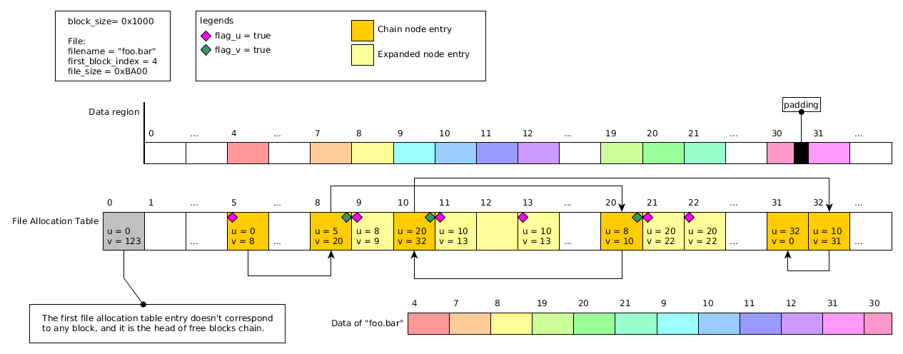

# 3DS Save Format

## Scope of This Documentation
This documentation describes the format for 3DS normal save contained in cartridge, SD and NAND. It does not cover extdata or any other type of saves.

However, this documentation only describe plaintext DISA format and its content. Any encryption layer on top of it, such as cartridge save encryption, SD file encryption, or NAND partition encryption, is not covered.

## General Rule
 - All fields are little-endian
 - All "padding" fields can contain random data from uninitialized memory unless marked as "?" or otherwise stated.
 - " :thinking: " is put next to unfinished/unconfirmed thing

## Overview of a Save file
A save file consists of the following components
 - AES CMAC Header
 - DISA Header
 - Two Partition Tables
 - SAVE Partition
 - DATA Partition (optional)

Note:
 - Among the two partition tables, only one is active at one time. For a new-created save file, it is possible that the inactive partition table contains invalid data.
 - There are two type of saves: with or without the DATA partition. The type is decided by the parameter `duplicate data` when formating a save (`FS:FormatSaveData` or `CreateSystemSaveData`). When this parameter is 0 (`false`), the DATA partition presents. The implication of this second partition is explained in the following sections. In a few words, NOT having the second partition (i.e. `duplicate data = true`) makes all save data duplicated. When a save archive is opened, all operation is done on the non-active part of the data (probably via the non-active partition table), and only if `ControlArchive(Commit)` is called before closing the archive, the non-active part will be activated and all the change made to the archive is effectively saved.

## AES CMAC Header
The AES CMAC is located at the beginning of the save file image, and it is 0x10 long. the rest 0xF0 bytes before the DISA Header are padding/unused.

The key used for AES CMAC is generated by the hardware key scrambler. For NAND/SD save, key slot 0x30 is used, whose value is console-unique; for card save, key slot 0x33  is used (:thinking:).

The data being authenticated by AES CMAC is a 0x20-byte SHA-256 hash of a data block (called "digest block" below). The digest block has different content formats among card, SD and NAND save. Effectively, all digest blocks contain a copy or a hash of DISA header (including the its main hash), so the AES CMAC authenticates the whole save image.

### Card Save Digest Block
_TODO_ :thinking:

### SD Save Digest Block

The digest block for SD Save is 0x30 bytes long.

|Offset|Length|Description|
|-|-|-|
|0x00|8|Magic "CTR-SIGN"|
|0x08|8|Title ID|
|0x10|0x20|SHA-256|

The SHA-256 in this digest block is over the following 0x108-byte data block:

|Offset|Length|Description|
|-|-|-|
|0x00|8|Magic "CTR-SAV0"|
|0x08|0x100|Copy of the DISA header|

### NAND Save Digest Block

The digest block for NAND Save is 0x110 bytes long.

|Offset|Length|Description|
|-|-|-|
|0x00|8|Magic "CTR-SYS0"|
|0x08|8|Save ID. The higher word is always zero|
|0x10|0x100|Copy of the DISA header|

## DISA Header
The DISA header is located at 0x100 in the save file image.

|Offset|Length|Description|
|-|-|-|
|0x00|4|Magic "DISA"|
|0x04|4|Magic 0x40000|
|0x08|4|Partition count, 1 or 2|
|0x0C|4|Padding|
|0x10|8|Secondary partition table offset|
|0x18|8|Primary partition table offset|
|0x20|8|Partition table size|
|0x28|8|SAVE partition descriptor offset in the partition table|
|0x30|8|SAVE partition descriptor size|
|0x38|8|DATA partition descriptor offset in the partition table|
|0x40|8|DATA partition descriptor size|
|0x48|8|SAVE partition offset|
|0x50|8|SAVE partition size|
|0x58|8|DATA partition offset|
|0x60|8|DATA partition size|
|0x68|1|Active table, 0 = primary, 1 = secondary|
|0x69|3|Padding|
|0x6C|0x20|SHA-256 over the active table|
|0x8C|0x74|Unused, might contain leftover data|

This header defines the rest components of the file (Partition tables, SAVE partition and DATA partitions). All offsets in this header are relative to the beginning of the, except for partition descriptor offsets, which are relative to the beginning of the (active) partition table.

## Partition Table & Partition Descriptor
A partition table contains 1 or 2 descriptors, depending on the existence of DATA partition. A partition descriptor contains the following components:
 - DIFI header
 - IVFC descriptor
 - DPFS descriptor
 - Partition Hash

### DIFI Header
The DIFI header locates at the beginning of a partition descriptor.

|Offset|Length|Description|
|-|-|-|
|0x00|4|Magic "DIFI"|
|0x04|4|Magic 0x10000|
|0x08|8|IVFC descriptor offset|
|0x10|8|IVFC descriptor size|
|0x18|8|DPFS descriptor offset|
|0x20|8|DPFS descriptor size|
|0x28|8|Partition hash offset|
|0x30|8|Partition hash size|
|0x38|1|When this byte is non-zero, this is a DATA partition, and the IVFC level 4 is located outside DPFS tree. See below|
|0x39|1|DPFS tree level 1 selector|
|0x3A|2|Padding|
|0x3C|8|(For DATA partition only) IVFC level 4 offset|

This header defines the rest components of the partition descriptor (IVFC descriptor, DPFS descriptor and partition hash). All offsets are relative to the beginning of the partition descriptor, except for `IVFC level 4 offset`, which is related to the beginning of the (DATA) partition.

### IVFC Descriptor

|Offset|Length|Description|
|-|-|-|
|0x00|4|Magic "IVFC"|
|0x04|4|Magic 0x20000|
|0x08|8|Master hash size = partition hash size in DIFI header|
|0x10|8|IVFC level 1 offset|
|0x18|8|IVFC level 1 size|
|0x20|4|IVFC level 1 block size in log2|
|0x24|4|Padding|
|0x28|8|IVFC level 2 offset|
|0x30|8|IVFC level 2 size|
|0x38|4|IVFC level 2 block size in log2|
|0x3C|4|Padding|
|0x40|8|IVFC level 3 offset|
|0x48|8|IVFC level 3 size|
|0x50|4|IVFC level 3 block size in log2|
|0x54|4|Padding|
|0x58|8|IVFC level 4 offset (unused for DATA partition? :thinking:)|
|0x60|8|IVFC level 4 size|
|0x68|8|IVFC level 4 block size in log2|
|0x70|8|IVFC descriptor size? usually 0x78 :thinking:|

This header defines each level of IVFC tree (will explain below). All the offsets are relative to the beginning of DPFS level 3.

### DPFS Descriptor

|Offset|Length|Description|
|-|-|-|
|0x00|4|Magic "DPFS"|
|0x04|4|Magic 0x10000|
|0x08|8|DPFS level 1 offset|
|0x10|8|DPFS level 1 size|
|0x18|4|DPFS level 1 block size in log2 (unused? :thinking:)|
|0x1C|4|Padding|
|0x20|8|DPFS level 2 offset|
|0x28|8|DPFS level 2 size|
|0x30|4|DPFS level 2 block size in log2|
|0x34|4|Padding|
|0x38|8|DPFS level 3 offset|
|0x40|8|DPFS level 3 size|
|0x48|4|DPFS level 3 block size in log2|
|0x4C|4|Padding|

This header defines each level of DPFS tree (will explain below). All the offsets are relative to the beginning of the partition.

### DIFI Hash
This is a SHA-256 hash list over IVFC level 1. See the IVFC tree section for detail. After the hash, there is additional unused 4 bytes. This 4 bytes are 0xFFFFFFFF in ciphertext.

## Partition
The SAVE partition and the DATA partition has slightly different structures.

For SAVE partition, it contains:
 - A three-level DPFS tree, and inside level 3
   - A four-level IVFC tree, and inside level 4
     - The SAVE image

For DATA partition, it contains:
 - A three-level DPFS tree, and inside level 3
   - The first three levels of a four-level IVFC tree
 - Level 4 of the IVFC tree, and inside
   - The DATA image

### DPFS Tree
Everything inside the DPFS tree comes in pairs, and at one time only one of a pair is active. The tree is probably designed for data staging: for a file writing operation, it writes to the inactive part, then commit the data by switching a bit to activate it.

Each level of DPFS tree consists of a pair of chunks. The size of one chunk is defined as it in the DPFS descriptor, so the total size of a level is actually twice as large as the size recorded in the descriptor. For level 1 and 2, the chunk is a bit array, in which each bits corresponds to a block in the next level (the block size of the next level is defined in the DPFS descriptor). This bit indicates which one of the pair in the next level is active for this block: 0 means the first one and 1 means the second one. The active chunk of level 1 is selected by `DPFS tree level 1 selector` in the DIFI header. The bit array is encoded in u32 array, with MSB as the first bit of each 32 bits.

To access data in level 3, one need to check the bits in level 1 and level 2 to know which chunk of level 3 is active for the accessing location. For example, for a following configuration:
 - Level 1: size = 4 bytes = 32 bits
 - Level 2: size = 0x380 bytes = 0x1C00 bits, block size = 0x80 bytes
 - Level 3: size = 0x1B7F000, block size = 0x1000, block size = 0x1000 bytes

and one want to read byte at 0x1234567 of level 3, the following calculation is performed:
 - get level 2 bit index `0x1234567 / 0x1000 = 0x1234`, and its byte location `0x1234 / 8 = 0x246`
 - get level 1 bit index `0x246 / 0x80 = 4`
 - get `level1_selector` from DIFI header
 - read `level2_selector = Level1[level1_selector].bits[4]`;
 - read `level3_selector = Level2[level2_selector].bits[0x1234]`;
 - read `data = Level3[level3_selector].bytes[0x1234567]` as the final data
 - in the code above `Levelx[k]` means the `k`-th chunk in level `x`, where `k = 0, 1`. `.bits[n]` is expanded to `(.u32_array[n / 32] >> (31 - n % 32)) & 1` as the bit array is encoded in u32 array.

Effectively, the active data is scattered among the two level 3 chunk. One can assemble the whole active level 3 image following the same rule.

### IVFC Tree
The IVFC tree is used for data verification. It is very similar to the IVFC tree in RomFS, except it has an additional level in save file. For level 1, 2 and 3, each level is a list of SHA-256 hash, of which each corresponding to a block of the next level, padded to block size (the block size of the next level is defined in the IVFC descriptor).

The partition hash (a.k.a "master hash") in the partition descriptor can be seen as IVFC level 0, which hashes level 1 following the same rule. The partition hash is usually 0x20 long consisting only one hash. This is because most save file is not large enough to have multiple hashes on the top level.

However, not all data are hashed - only ranges that have been written with valid data are properly hashed. It is even observed that one file in the filesystem (will be introduced later) can have part of its data unhashed. This happens when a file is create with a large size, but only part of the data is filled by File:Write, and FS will refuse to read the unwritten (unhashed) part, returning verification failure error. (This probably needs more test to confirm)

Level 4 is the actual core of the partition. It is either the SAVE image for a SAVE partition, or a DATA image for a DATA partition.

This also explains the parameter `duplicate data`. If this is set to `false`, the DATA partition, whose IVFC level 4 is outside the DPFS tree, is created, meaning that the DATA image doesn't get duplicated by the DPFS tree.

## Filesystem
In the SAVE image and the optional DATA image, there is a filesystem consisting of the following components
 - SAVE header
 - Directory Hash Table
 - File Hash Table
 - File Allocation Table
 - Directory Entry Table (can be in data region)
 - File Entry Table (can be in data region)
 - Data region

If the DATA image exists, data region is the whole DATA image; other wise, data region is located inside the SAVE image.

### SAVE Header

|Offset|Length|Description|
|-|-|-|
|0x00|4|Magic "SAVE"|
|0x04|4|Magic 0x40000|
|0x08|8|Filesystem Information offset (0x20)|
|0x10|8|Image size in blocks|
|0x18|4|Image block size|
|0x1C|4|Padding|
|||Below is Filesystem Information|
|0x20|4|Unknown:thinking:|
|0x24|4|Data region block size|
|0x28|8|Directory hash table offset|
|0x30|4|Directory hash table bucket count|
|0x34|4|Padding|
|0x38|8|File hash table offset|
|0x40|4|File hash table bucket count|
|0x44|4|Padding|
|0x48|8|File allocation table offset|
|0x50|4|File allocation table entry count|
|0x54|4|Padding|
|0x58|8|Data region offset (if no DATA image)|
|0x60|4|Data region block count (= File allocation table entry count)|
|0x64|4|Padding|
|0x68|8|If DATA exists: directory entry table offset;
|||otherwise: u32 directory entry table starting block index + u32 directory entry table block count|
|0x70|4|Maximum directory count|
|0x74|4|Padding|
|0x78|8|If DATA exists: file entry table offset;
|||otherwise: u32 file entry table starting block index + u32 file entry table block count|
|0x80|4|Maximum file count|
|0x84|4|Padding|

 - All "offsets" are relative to the beginning of SAVE image. All "starting block index" are relative to the beginning of data region.
 - The file/directory bucket count & maximum count fields are the same as the arguments passed in when formating the save.
 - When DATA partition doesn't exist, directory & file entry tables are allocated in the data region, and while be marked allocated in file allocation table as if they are two normal files. However, only continuous allocation as been observed, so directly reading `block_count * block_size` bytes from `data_region + starting_block_index * block_size` should be safe. See the section _File Allocation Table_ below for more information.

### Directory Entry Table
The directory entry table is an array of the following entry type. It describes the directory hierarchy of the filesystem.

|Offset|Length|Description|
|-|-|-|
|0x00|4|Parent directory index. 0 for root|
|0x04|16|Directory name. "" for root|
|0x14|4|Next sibling directory index. 0 if this is the last one|
|0x18|4|First subdirectory index. 0 if not exists|
|0x1C|4|First file index in file entry table. 0 if not exists|
|0x20|4|0? :thinking:|
|0x24|4|Index of the next directory in the same hash table bucket. 0 if this is the last one|

There are also some dummy entries in the array:

|Offset|Length|Description|
|-|-|-|
|0x00|4|Current Total entry count|
|0x04|4|Maximum entry count = maximum directory count + 2|
|0x08|28|Padding / All zero|
|0x24|4|Index of the next dummy entry. 0 if this is the last one|

The 0-th entry of the array is always a dummy entry, which functions as the head of the dummy entry linked list. The 1-st entry of the array is always the root. Therefore maximum entry count is two more than maximum directory count. Dummy entries are probably left there when deleting directories, and reserved for future use.

### File Entry Table
The file entry table is an array of the following entry type. It contains information for each file.

|Offset|Length|Description|
|-|-|-|
|0x00|4|Parent directory index in directory entry table|
|0x04|16|File name|
|0x14|4|Next sibling file index. 0 if this is the last one|
|0x18|4|Padding|
|0x1C|4|First block index in data region. 0x80000000 if the file is just created and has no data.|
|0x20|8|File Size|
|0x28|4|Unknown. Sometimes 1, sometimes like timestamps :thinking:|
|0x2C|4|Index of the next file in the same hash table bucket. 0 if this is the last one|

Like directory entry table, file entry table also has some dummy entries:

|Offset|Length|Description|
|-|-|-|
|0x00|4|Current total entry count|
|0x04|4|Maximum entry count = maximum file count + 1|
|0x08|36|Padding / All zero|
|0x2C|4|Index of the next dummy entry. 0 if this is the last one|

The 0-th entry of the array is always a dummy entry, which functions as the head of the dummy entry linked list. There for maximum entry count is one more than maximum file count. Dummy entries are probably left there when deleting files, and reserved for future use.

### Directory Hash Table & File Hash Table
This is a u32 array of size = bucket count, each of which is an index to the directory/file entry table. The directory/file name is hashed and its entry index is put to the corresponding bucket. If there is already a directory/file entry in the bucket, then it appends to the linked list formed by `Index of the next directory/file in the same hash table bucket` field in the directory/file entry table.

The hash function is
```
uint32_t GetBucket(
    char name[16], // takes all 16 bytes including trailing zeros
    uint32_t parent_dir_index,
    uint32_t bucket_count
) {
    uint32_t hash = parent_dir_index ^ 0x091A2B3C;
    for (int i = 0; i < 4; ++i) {
        hash = (hash >> 1) | (hash << 31);
        hash ^= (uint32_t)name[i * 4]
        hash ^= (uint32_t)name[i * 4 + 1] << 8
        hash ^= (uint32_t)name[i * 4 + 2] << 16
        hash ^= (uint32_t)name[i * 4 + 3] << 24
    }
    return hash % bucket_count;
}
```

### File Allocation Table
The file allocation table is an array of the following 8-byte entry. The array size is actually one more than the size recorded in the SAVE header. Each entry corresponds to a block in the data region (the block size is defined in SAVE header). However, the 0th entry corresponds to nothing, so the corresponding block index is off by one. e.g. entry 31 in this table corresponds to block 30 in the data region.

|Offset|Length|Description|
|-|-|-|
|0x00|4|bit[0:30]: Index U; bit[31]: Flag U
|0x04|4|bit[0:30]: Index V; bit[31]: Flag V|

Entries in this table forms several chains, representing how blocks in the data region should be linked together. However, unlike normal FAT system, there are three kinds of entry in this table:
 - Chain node entry.

    - `Index U` is the index of the previous chain node entry (0 if this is the first node).

    - `Index V` is the index of the next chain node entry(0 if this is the last node).

    - `Flag U` is set for the first node for a file.

    - `Flag V` is set when this node entry is followed by a group of one or more expanded node entries.
 - Expanded node entry.

    - `Index U` is the index of the leading chain node entry and
    - `Index V` is the index of the last block in the expanded node. However only the first and the last expanded node entries in a group has these two index set. For other entries, these two index is unused, and can be even unhashed by IVFC tree if the group is large enough.

    - `Flag U` is set for the first and the last node in a group.
  - Leading entry. This is always the 0-th entry.
    - `Index V` is the index of the first node for the "free block file". All free blocks are chained in this file.

Here is an example of how a file is reconstructed following the file allocation table:


TODO: explain more if this picture is insufficient.

## Recap of How to Extract Files From a Save File
 - Find the active partition table and the partition(s).
 - Unwrap DPFS tree of partition(s) by reconstructing active data.
 - Unwrap IVFC tree. Either take out level 4 directly, or, better, verify all the hashes and poison the data that is not properly hashed.
 - For DATA partition, since its IVFC level 4 is out side DPFS tree, the DPFS unwrapping step can be skipped. However, if one wants to poison the unhashed data, DPFS tree still need to be unwrapped to get the first three levels of IVFC tree.
 - Find the directory & file entry table and iterate over them.
 - For each file, follow its chain in the file allocation table and reconstruct the data from data region.

## Recap of Chain of Trust
 - CMAC header verifies DISA header
 - DISA header verifies partition table
 - In the partition table, each entry verifies level 1 of its IVFC tree
 - Each IVFC level verifies the next level, until the level 4, which contains all file data and metadata.
